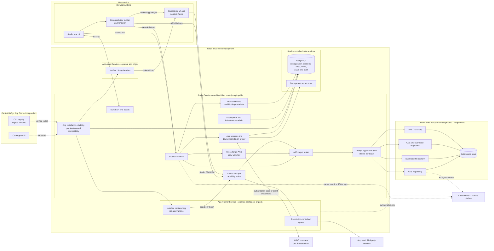
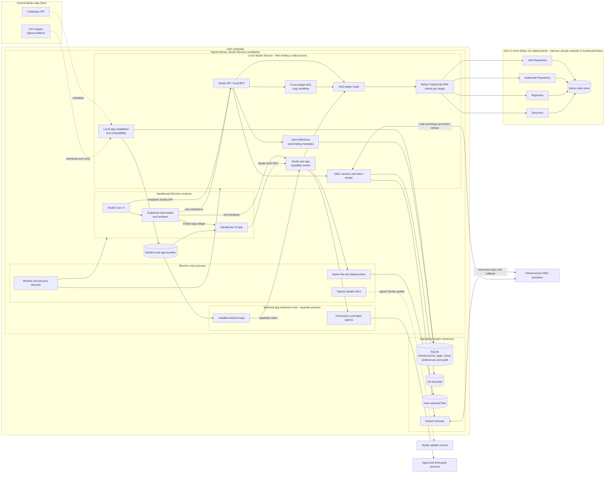
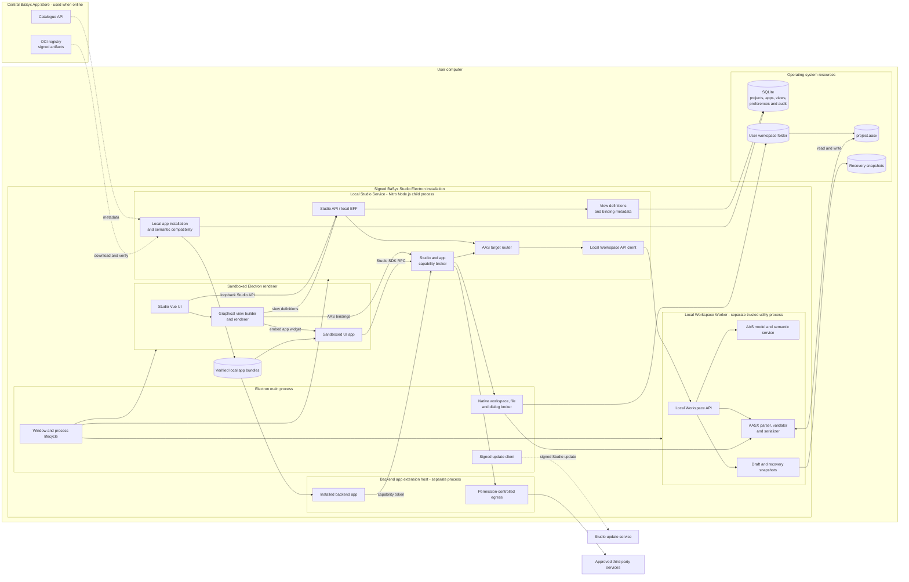

# Deployment Variants

These are the canonical component diagrams for the three primary variants. Each diagram shows only components valid for that variant and uses subgraphs to distinguish deployable/service/process ownership.

Shared rule: the same Studio UI and installed apps call one versioned Studio API
and capability surface in every variant. The BFF/target router selects the
implementation-specific AAS adapter and returns common DTOs, capabilities,
revisions, and errors. HTTP is the default request/response transport, SSE
carries one-way progress and invalidation events with polling as fallback, and
WebSockets are reserved for proven bidirectional workflows.

## 1. Hosted web Studio with live AAS infrastructure

This variant covers hosted catalogues and other live Type 2 shell workflows. The
configured BaSyx infrastructures may be remote or on the same private network,
but they are independent from the Studio deployment.

## 2. Desktop Studio with live AAS infrastructure

There is no hosted Studio backend. The local Studio Service connects to one or
more Internet, private-network, or localhost/Docker BaSyx infrastructures.

## 3. Desktop Studio with local AASX workspace

This is the offline package-explorer/designer replacement. It has no BaSyx server dependency.

## Boundary summary

- Studio Service: trusted Nuxt/Nitro BFF in every variant; hosted centrally or spawned locally.
- Graphical view builder/renderer: Studio UI module in every variant; definitions use the existing Studio database.
- Cross-target AAS copy: Studio Service module only in the two live-infrastructure variants.
- Local Workspace Worker: only desktop AASX.
- Live BaSyx deployment: only connected variants.
- App runner/extension host: outside the Studio Service in every variant.
- App Store: central independent platform shared by all variants.
