# Important Mechanisms

These are the canonical sequence diagrams for cross-component behavior. The
[deployment variants](deployment-variants.md) define where each participant
runs. Topic documents explain the rules behind the sequences.

## Register a live AAS infrastructure

Infrastructure registration is a Studio administration operation. Secrets are
stored server-side and connectivity is checked before the configuration becomes
available to users.

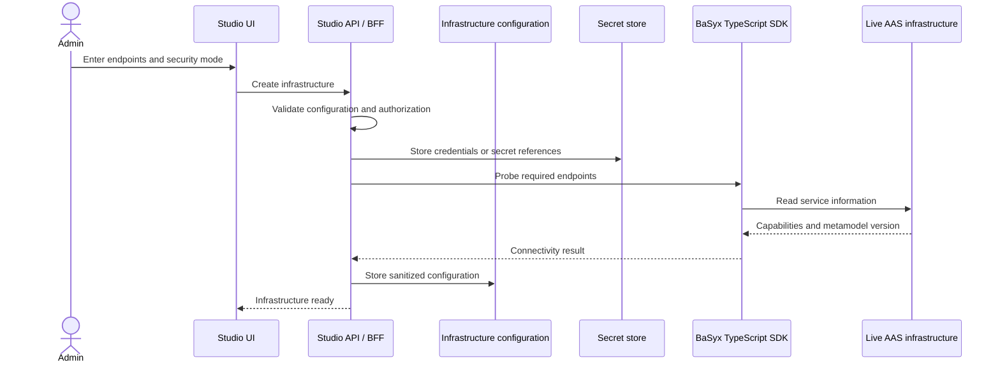

## User login and downstream token refresh

The browser receives only an opaque Studio session. OAuth tokens stay in the
Studio Service and are encrypted at rest where persistence is required.

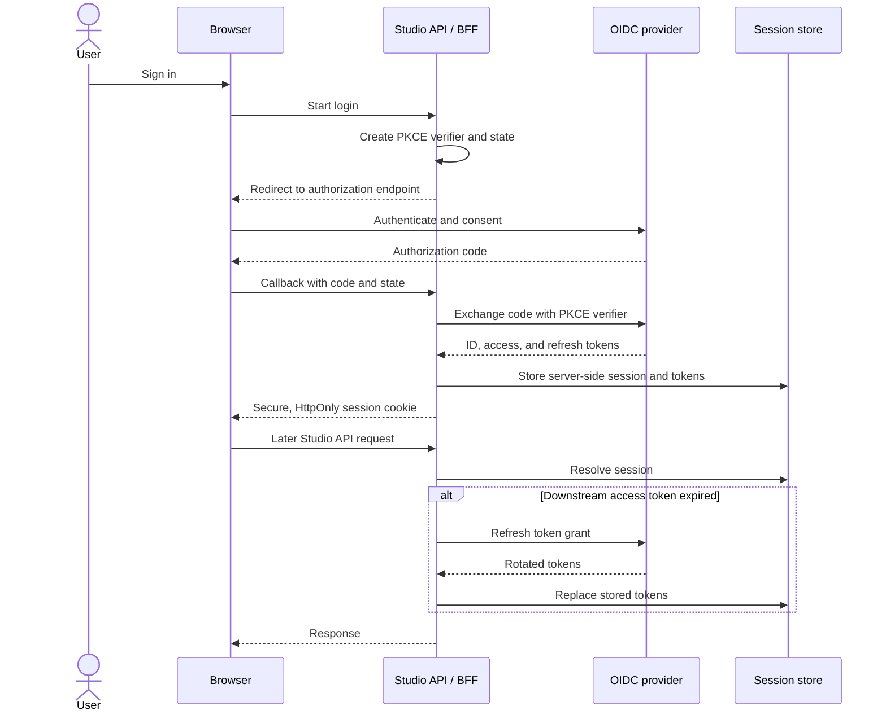

## Client-credentials access to a live AAS infrastructure

This mode lets a hosted Studio expose a curated catalogue without forwarding
end-user credentials to the AAS provider. Studio still authorizes every user
operation and records who caused it.

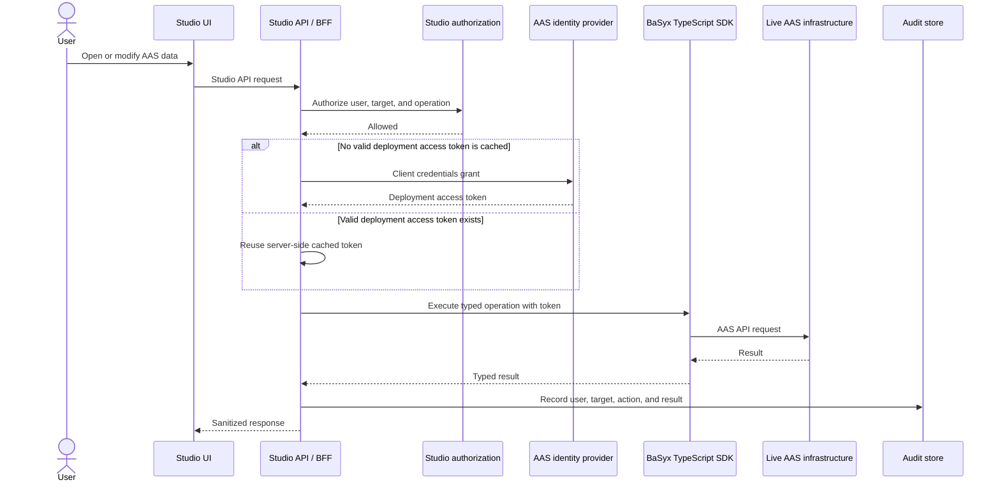

## Live AAS query or command

The BFF resolves an opaque target ID and invokes the BaSyx TypeScript SDK. The
browser and apps never assemble trusted downstream URLs or handle credentials.

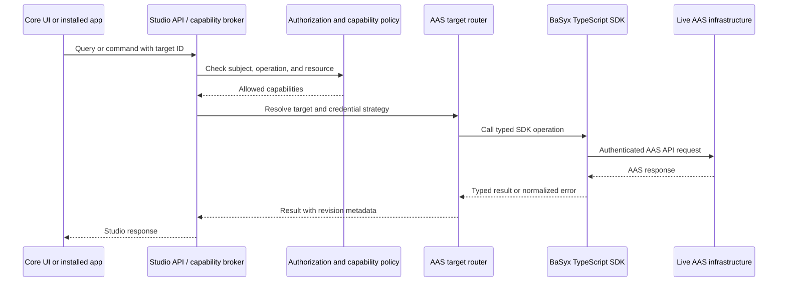

## Switch the active target

Target-specific state is discarded or partitioned when users switch between
infrastructures and workspaces. Query keys include the target ID to prevent data
from one target appearing in another.

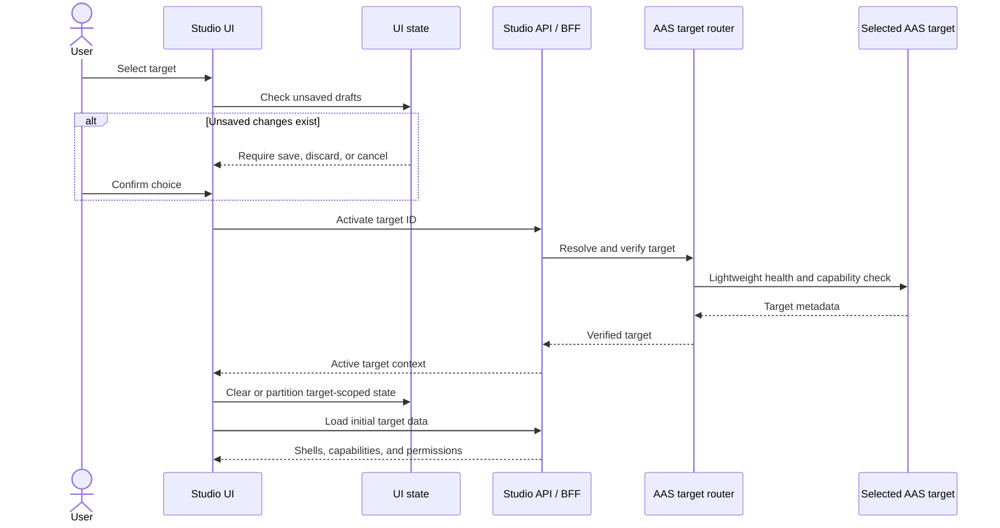

## Copy an AAS between authenticated infrastructures

Source and destination are resolved independently. The BFF holds both credential
contexts, builds a preflight plan, and performs a snapshot copy through separate
BaSyx TypeScript SDK clients. The operation does not imply continuous sync or an
atomic transaction across the two infrastructures.

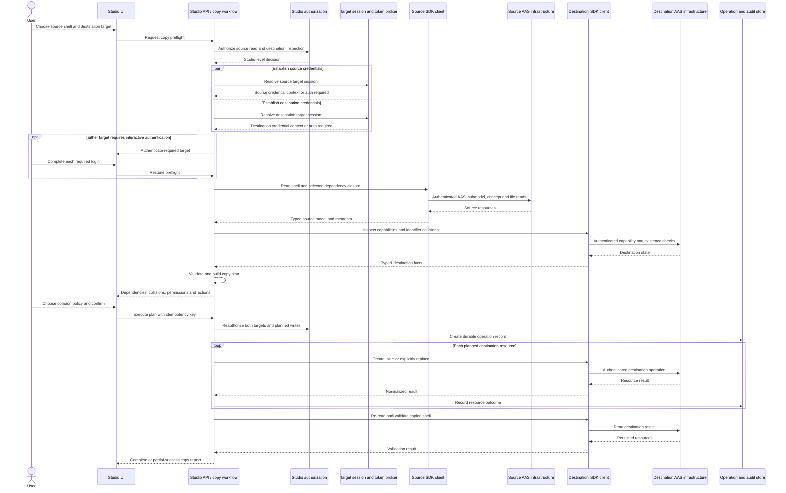

## Author and run a graphical AAS view

The builder persists a declarative definition and uses the same renderer,
binding resolution, authorization, and app sandbox as runtime viewing. App
widgets never become trusted core components.

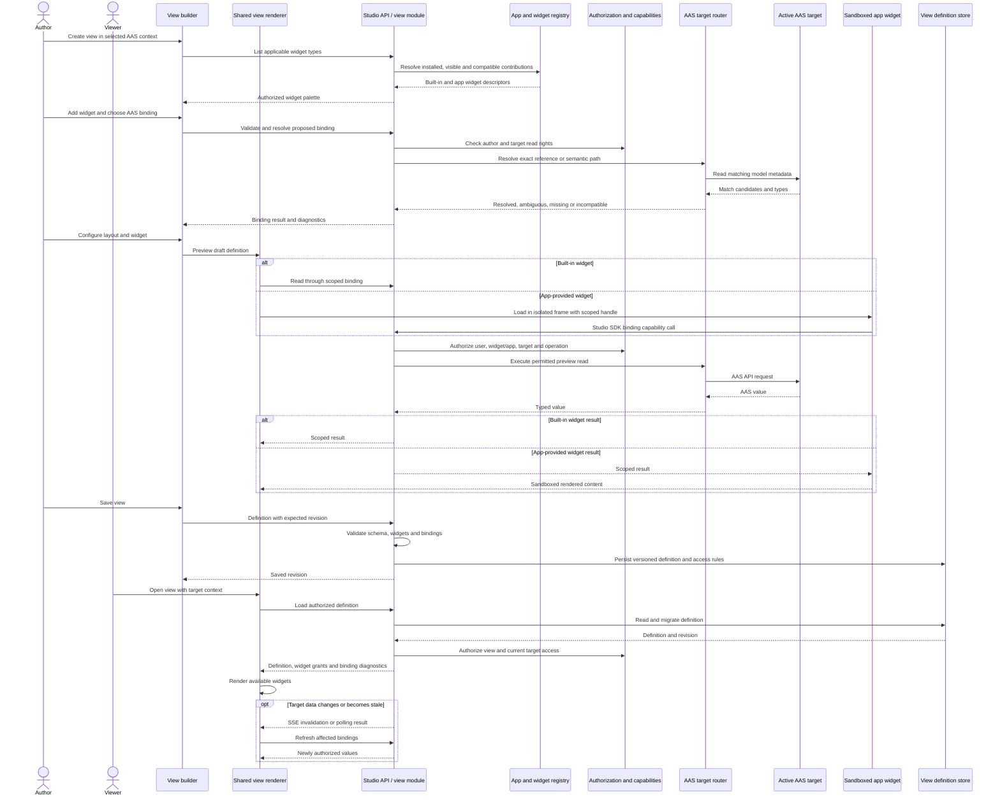

## Desktop local AASX lifecycle

The renderer cannot access the file system directly. Electron brokers native
dialogs, and a supervised Workspace Worker performs validation, revisions, and
serialization within the selected project directory.

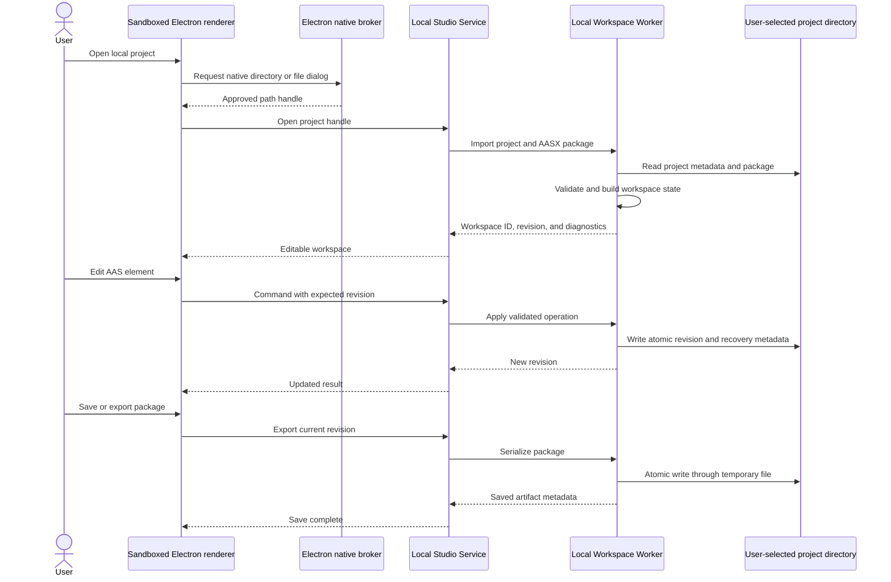

## Publish, install, and activate an app

Apps are built and signed by the marketplace pipeline. Installation creates a
deployment- or machine-scoped record; activation additionally evaluates
permissions, administrator policy, user visibility, and AAS semantic
compatibility.

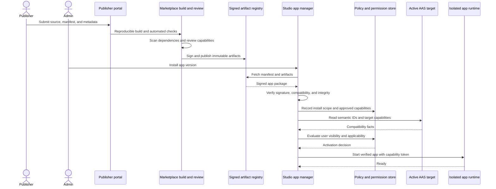

## Installed app capability call

An app receives no ambient authority. Every AAS, file, network, or shared Studio
operation goes through a narrow capability API and is evaluated against the
installed manifest plus deployment policy.

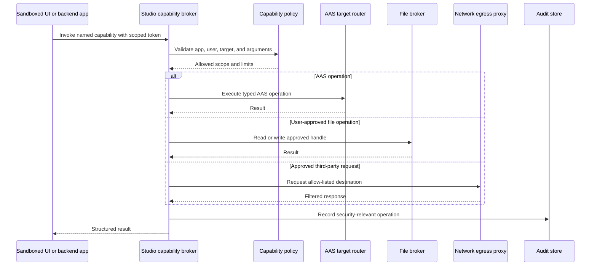

## Desktop update from an older version

Desktop releases are signed and update metadata is verified. The updater must
support at least the current version and the previous two supported release
lines, including ordered configuration and workspace migrations.

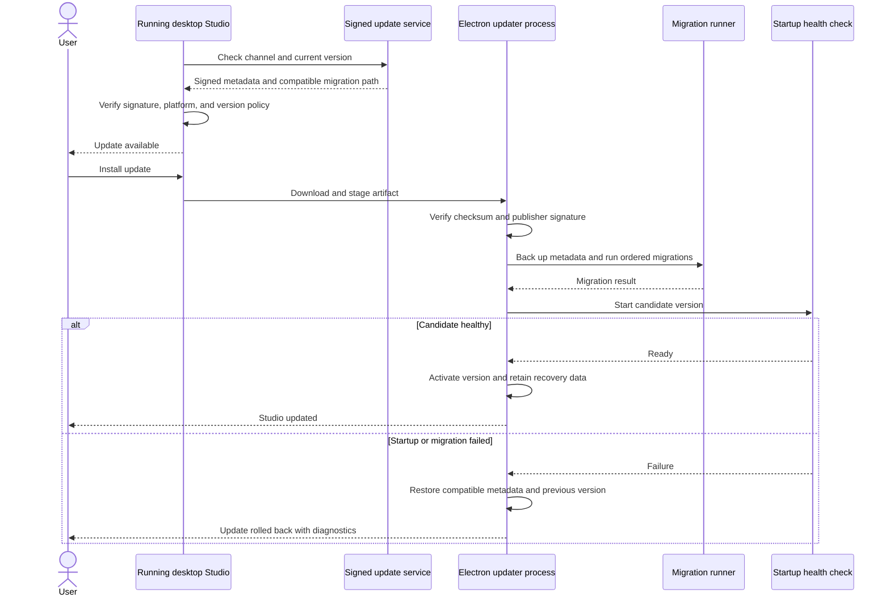

## Realtime transport rule

Queries and commands use ordinary HTTP. Server-Sent Events are the default for
one-way progress and invalidation. WebSockets are introduced only for a proven
bidirectional use case such as collaborative editing or interactive app
protocols; they are not the CRUD transport.
